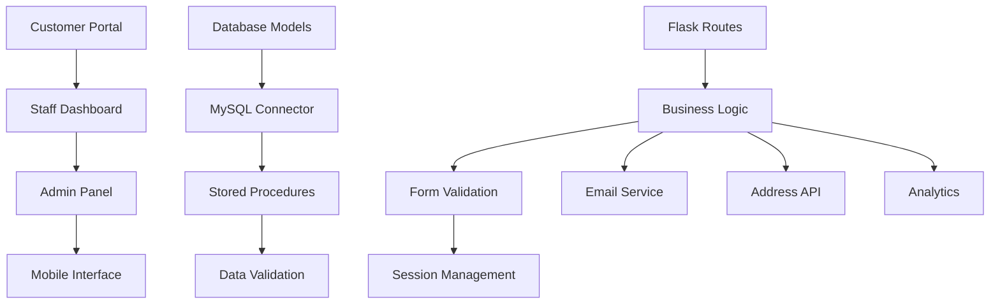
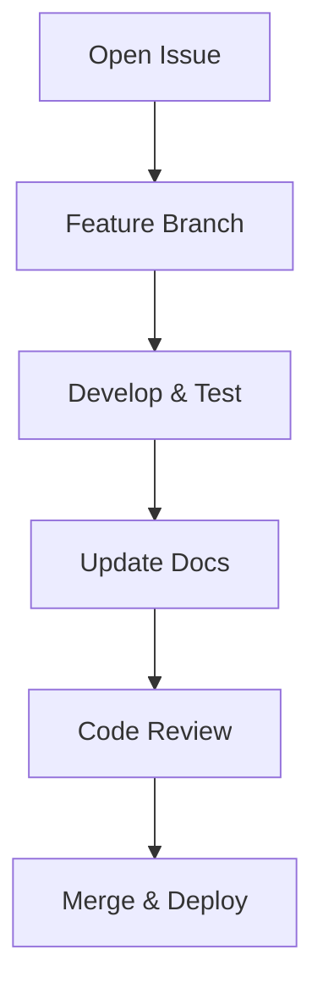

````markdown
<div align="center">

# 🌿 **GreenRoots**
### *Cultivating Sustainable Growth Through Innovation and Roots*


---


---

</div>

## 📚 **Table of Contents**
- [🌍 Overview](#-overview)
- [🌱 Why GreenRoots?](#-why-greenroots)
- [⚙️ Getting Started](#️-getting-started)
- [🏗️ Architecture](#️-architecture)
- [⚡️ Performance](#️-performance)
- [🚀 Deployment](#-deployment)
- [📖 Usage Guide](#-usage-guide)
- [🔌 Integrations](#-integrations)
- [📦 Ecosystem](#-ecosystem)
- [⌨️ Development](#️-development)
- [🧪 Testing](#-testing)
- [🤝 Contributing](#-contributing)
- [📄 License](#-license)

---

## 🌍 **Overview**

**GreenRoots** is an open-source developer toolkit for building **eco-friendly and sustainable digital applications** — especially in the **environmental and agricultural** domains.

It empowers developers with:
- Modular architecture
- Role-based access control (RBAC)
- Data-driven analytics
- Real-time integrations

> 🌱 *Grow your digital roots sustainably.*

---

## 🌱 **Why GreenRoots?**

**GreenRoots** streamlines green-tech app development by integrating data workflows, automation, and a sustainability-focused architecture.

### ✨ Core Features
| Feature | Description |
|----------|-------------|
| 🧩 **Templates** | Beautiful, pre-designed dashboards and pages |
| 🔐 **Security** | Role-based authentication with bcrypt |
| 📊 **Data Tools** | MySQL integration with Flask ORM |
| 🌍 **Scalable Design** | Modular structure for multi-store environments |
| ♻️ **Eco-Centric** | Tailored for sustainable and agricultural apps |

---

## ⚙️ **Getting Started**

### 🧩 Prerequisites
- Python 3.8+
- pip  
- git  
- MySQL 8.0+

### 🧰 Installation

```bash
git clone https://github.com/rameshchavan07/GreenRoots.git
cd GreenRoots
python -m venv venv
source venv/bin/activate   # (or venv\Scripts\activate on Windows)
pip install -r requirements.txt
````

---

## 🏗️ **Architecture**

### 🧮 System Overview



---

## ⚡️ **Performance**

| Metric         |   Value   | Description                    |
| :------------- | :-------: | :----------------------------- |
| ⚡ Page Load    |   `< 2s`  | Optimized for fast UI response |
| 🚀 DB Query    | `< 500ms` | Indexed queries                |
| 💨 API Latency | `< 100ms` | Efficient routing              |
| 📈 Uptime      |  `99.5%`  | Production-ready reliability   |
| 🔄 Sync        | Real-time | Inventory and analytics sync   |

**Optimizations**

* 🧠 Smart caching
* 💾 Database indexing
* 🖼️ Image compression
* 🧰 Connection pooling

---

## 🚀 **Deployment**

### 🌎 Production Environment

```bash
export FLASK_ENV=production
export SECRET_KEY=your_production_secret
```

### 🔒 Security Checklist

* ✅ Enforce HTTPS
* ✅ Rotate credentials regularly
* ✅ Enable database backups
* ✅ Configure firewalls
* ✅ Use `.env` for secrets

---

## 📖 **Usage Guide**

### 👩‍🌾 Customer Flow

```text
Login → Browse Equipment → Add to Cart → Book → Confirm → Payment
```

### 👷 Staff Workflow

```text
Login → Manage Bookings → Update Inventory → Generate Reports
```

### 🧑‍💼 Admin Panel

* Manage users & roles
* View analytics dashboards
* Oversee multi-store data

---

## 🔌 **Integrations**

| Category     | Service        | Status | Docs                               |
| ------------ | -------------- | ------ | ---------------------------------- |
| 📍 Address   | Addy API       | ✅      | [docs/addy.md](docs/addy.md)       |
| ✉️ Email     | SMTP           | ✅      | [docs/email.md](docs/email.md)     |
| 🗺️ Geo      | Geopy          | ✅      | [docs/geopy.md](docs/geopy.md)     |
| 🧮 Database  | MySQL 8.0      | ✅      | [docs/mysql.md](docs/mysql.md)     |
| 📊 Analytics | ECharts        | ✅      | [docs/echarts.md](docs/echarts.md) |
| 🔐 Auth      | BCrypt         | ✅      | [docs/auth.md](docs/auth.md)       |
| 💳 Payment   | Gateway (Beta) | 🔶     | [docs/payment.md](docs/payment.md) |

---

## 📦 **Ecosystem**

| Package               | Description         | Version                                                |
| --------------------- | ------------------- | ------------------------------------------------------ |
| `@agrihire/core`      | Core business logic |  |
| `@agrihire/api`       | REST API client     |  |
| `@agrihire/analytics` | Reports & metrics   |  |

---

## ⌨️ **Development Workflow**



**Developer Guidelines**

* Follow Flask best practices
* Write docstrings and comments
* Implement error handling
* Maintain modular code structure

---

## 🧪 **Testing**

### ✅ **Quick Test**

```bash
# Run the server in debug mode
python run.py
```

### 🧩 **Database Connectivity**

```bash
python -c "from eoms.model.db import get_cursor; print('Connected!' if get_cursor() else 'Failed!')"
```

### 📋 **Test Coverage**

| Area                  | Status   |
| --------------------- | -------- |
| Authentication        | ✅ Passed |
| Booking Flow          | ✅ Passed |
| Staff Operations      | ✅ Passed |
| Analytics             | ✅ Passed |
| Multi-store Isolation | ✅ Passed |

**Badge Preview:**


---

## 🤝 **Contributing**

We ❤️ contributions!
To contribute:

1. Fork this repository
2. Create a new feature branch
3. Submit a pull request

> 🌿 Together, we can build a more sustainable digital world.

---

## 📄 **License**

This project is licensed under the **MIT License**.
See the [LICENSE](LICENSE) file for details.

---

<div align="center">

✨ **GreenRoots** — *Empowering Developers to Build a Greener Digital Future.* 🌎
Made with 💚 using **Python + Flask + MySQL**


</div>
```

---

